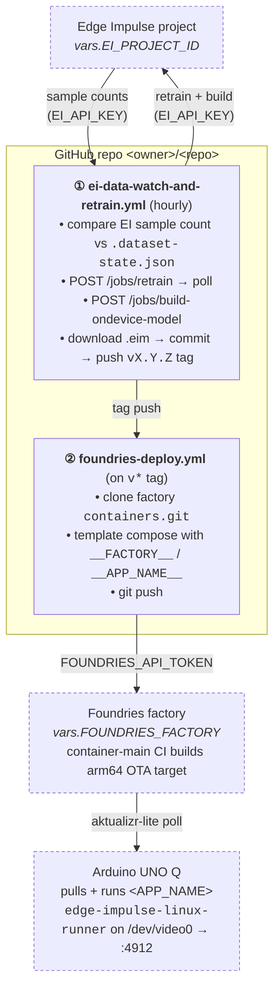

# ei-vision-uno-q-foundries

A reusable template that takes **any Edge Impulse vision project**, builds it for the **Arduino UNO Q**, and delivers it over-the-air through a **Foundries.io** factory — with auto-retraining on every new data upload.

> Object detection, image classification, and visual anomaly models all work; only the App Lab brick choice changes (see [App Lab brick mapping](#app-lab-brick-mapping)).

This repo ships a working coffee/lamp object detector as the bundled example — see [Included example](#included-example).

## Architecture



Two GitHub Actions workflows form the closed loop. ① watches EI for new data and produces a tagged release; ② reacts to that tag and pushes to the factory. From there Foundries' own CI takes over and the device polls for the new target.

## Included example

| Property        | Value                                                          |
|-----------------|----------------------------------------------------------------|
| Source          | Edge Impulse project [25483 — *Tutorial: object detection*](https://studio.edgeimpulse.com/studio/25483) |
| Type            | Object detection (FOMO)                                        |
| Classes         | `coffee`, `lamp`                                               |
| Input           | 320×320 RGB, `fit-short` resize                                |
| Architecture    | aarch64 ELF (Linux 3.7+)                                       |
| Quantization    | float32                                                        |
| Size            | ~25 MB                                                         |
| Files           | `app/model/object-detection.eim` *(source-of-truth, named for App Lab)*  ·  `containers/ei-vision/model.eim` *(generic name baked into the container)* |

The `app/app.yaml` shipped here wires this example into the App Lab `arduino:video_object_detection` brick. To swap in your own model, see [Adapt for a different EI project](#adapt-for-a-different-ei-project).

## Repo layout

```
.
├── app/                         # Arduino App Lab source-of-truth
│   ├── app.yaml                 # brick wiring (one of: object_detection, classification, ...)
│   └── model/
│       └── object-detection.eim # descriptive name; matches app.yaml
├── containers/
│   └── ei-vision/               # mirrored into source.foundries.io/.../containers.git
│       ├── Dockerfile           # debian:bookworm + edge-impulse-linux-runner
│       ├── docker-compose.yml   # uses __FACTORY__ / __APP_NAME__ placeholders
│       ├── docker-build.conf
│       └── model.eim            # generic name the Dockerfile expects
├── .dataset-state.json          # mutable state (sample count, last deployment version)
└── .github/workflows/
    ├── ei-data-watch-and-retrain.yml   # ①
    └── foundries-deploy.yml            # ②
```

## Configuration

All project-specific values are GitHub Actions **repo variables**, not hardcoded — set once on your fork.

| Variable             | Required | Default              | Notes                                                                 |
|----------------------|----------|----------------------|-----------------------------------------------------------------------|
| `EI_PROJECT_ID`      | yes      | —                    | Numeric Edge Impulse project ID                                       |
| `FOUNDRIES_FACTORY`  | yes      | —                    | Your factory name (the `<factory>` in `source.foundries.io/factories/<factory>`) |
| `EI_DEPLOY_TARGET`   | no       | `arduino-uno-q`      | EI deployment target name; only override if you're targeting a different board |
| `EI_MODEL_TYPE`      | no       | `float32`            | `float32` or `int8`. Object detection usually needs `float32`         |
| `EI_MODEL_FILENAME`  | no       | `object-detection.eim` | Filename under `app/model/`; should match the path in `app/app.yaml` |
| `APP_NAME`           | no       | `ei-vision`          | Name of the directory under `containers/` AND of the Foundries app folder |

Set them via the GitHub UI (*Settings → Secrets and variables → Actions → Variables*) or with `gh`:

```bash
gh variable set EI_PROJECT_ID     --repo <owner>/<repo> --body "12345"
gh variable set FOUNDRIES_FACTORY --repo <owner>/<repo> --body "my-factory"
# optional overrides:
gh variable set EI_MODEL_TYPE     --repo <owner>/<repo> --body "int8"
gh variable set APP_NAME          --repo <owner>/<repo> --body "widget-detector"
gh variable list                  --repo <owner>/<repo>
```

## Setup: GitHub secrets

The two automation workflows need credentials. Set them once on your fork:

| Secret                 | Used by                                  | Where to get it                                                                 |
|------------------------|------------------------------------------|---------------------------------------------------------------------------------|
| `EI_API_KEY`           | `ei-data-watch-and-retrain.yml`          | EI Studio → your project → **Dashboard → Keys** → copy the `ei_…` API key       |
| `FOUNDRIES_API_TOKEN`  | `foundries-deploy.yml`                   | https://app.foundries.io/settings/tokens/ → **New API Token** with `source:readwrite` scope |

Set them via the GitHub UI **or** the `gh` CLI:

**UI:** Repo → *Settings* → *Secrets and variables* → *Actions* → *New repository secret* → paste the name above and the value.

**CLI:**

```bash
gh secret set EI_API_KEY          --repo <owner>/<repo>   # paste EI key when prompted
gh secret set FOUNDRIES_API_TOKEN --repo <owner>/<repo>   # paste Foundries token
gh secret list                    --repo <owner>/<repo>   # verify both are present
```

These secrets are encrypted and only exposed to workflow runs at execution time. Rotate them in Edge Impulse / Foundries first, then re-run `gh secret set` to update GitHub.

## Setup: Register your UNO Q with the factory

Before any OTA target can land on the device, the UNO Q has to enroll itself with the factory using **fioup** (Foundries' container-only OTA client). Once registered, the device polls for new targets and runs whatever the factory has built. Reference: <https://docs.foundries.io/96/getting-started/fioup-registration/index.html>.

Run these on the **UNO Q itself** — the board runs Debian on aarch64. Two ways to get a shell:

- **SSH (recommended for headless use):** [docs.arduino.cc/tutorials/uno-q/ssh](https://docs.arduino.cc/tutorials/uno-q/ssh/) walks through enabling sshd, default credentials, and finding the device's IP. For Wi-Fi setup and remote-access basics see [docs.arduino.cc/tutorials/uno-q/remote-access](https://docs.arduino.cc/tutorials/uno-q/remote-access/).
- **Serial console over USB-C:** the Linux-side single-board computer exposes a console — see [docs.arduino.cc/tutorials/uno-q/single-board-computer](https://docs.arduino.cc/tutorials/uno-q/single-board-computer/) and the [Debian guide](https://docs.arduino.cc/tutorials/uno-q/debian-guide/) for the OS layout. The general overview is the [UNO Q user manual](https://docs.arduino.cc/tutorials/uno-q/user-manual/).

Once you're in:

**1. Install fioup from the official apt repo**

```bash
sudo apt update && sudo apt install -y apt-transport-https ca-certificates curl gnupg

curl -L https://fioup.foundries.io/pkg/deb/dists/stable/Release.gpg \
  | sudo gpg --dearmor -o /etc/apt/trusted.gpg.d/fioup-stable.gpg

echo 'deb [signed-by=/etc/apt/trusted.gpg.d/fioup-stable.gpg] https://fioup.foundries.io/pkg/deb stable main' \
  | sudo tee /etc/apt/sources.list.d/fioup.list

sudo apt update && sudo apt install -y fioup
```

You also need a recent Docker stack on the device:

```bash
sudo apt install -y docker.io docker-compose-v2
```

**2. Register the device against your factory**

```bash
sudo fioup register --factory <FOUNDRIES_FACTORY> --name <DEVICE_NAME>
```

`fioup` prints a one-time URL and user code. Open it in your browser and authorize the device (link expires in 15 minutes). When it returns `Device is now registered.`, registration is complete and the mTLS material is stored under `/var/sota/`.

**3. Verify connectivity**

```bash
sudo fioup check
```

The device should now appear at `https://app.foundries.io/factories/<FOUNDRIES_FACTORY>/devices/`.

**4. Enable the update service** so the device polls for and applies new targets automatically:

```bash
sudo systemctl enable --now fioup
```

**(Optional) Restrict which apps run.** By default, `fioup` runs every app the factory ships. To run only the app from this repo:

```bash
sudo tee -a /var/sota/sota.toml >/dev/null <<EOF

[pacman]
compose_apps = "<APP_NAME>"
EOF
sudo systemctl restart fioup
```

Once the device is registered, every tag pushed by the workflows above flows automatically: GitHub Actions → factory `containers.git` → factory CI → OTA target → `fioup` on the device → running container.

## Pipeline

### ① Auto-retrain on new data

[`.github/workflows/ei-data-watch-and-retrain.yml`](.github/workflows/ei-data-watch-and-retrain.yml) runs hourly. It:

1. Reads the current training+testing sample count from EI.
2. Compares it to `lastTrainedSampleCount` in [`.dataset-state.json`](.dataset-state.json).
3. If different (or `force=true` via manual dispatch): retrains the impulse, builds a new `.eim` for `EI_DEPLOY_TARGET`, updates both the descriptive copy (`app/model/${EI_MODEL_FILENAME}`) and the generic container copy (`containers/${APP_NAME}/model.eim`), bumps the patch version, and pushes a new `vX.Y.Z` tag.

Uses the `EI_API_KEY` secret and all of the variables in [Configuration](#configuration).

### ② Ship to the Foundries factory

[`.github/workflows/foundries-deploy.yml`](.github/workflows/foundries-deploy.yml) syncs `containers/${APP_NAME}/` into the factory's `containers.git` whenever a `v*` tag is pushed (or via *Actions → Run workflow* manually). Before pushing, it substitutes `__FACTORY__` and `__APP_NAME__` in `docker-compose.yml` so the image reference (`hub.foundries.io/<factory>/<app>:latest`) is correct for your factory.

Uses the `FOUNDRIES_API_TOKEN` secret.

**Manual fallback** if you don't want to run the workflow:

```bash
git clone https://source.foundries.io/factories/<FOUNDRIES_FACTORY>/containers.git
cp -r containers/<APP_NAME> /path/to/containers.git/
# edit docker-compose.yml and replace __FACTORY__ / __APP_NAME__
cd /path/to/containers.git
git add <APP_NAME> && git commit -m "<APP_NAME>: initial app"
git push  # triggers container-main CI build → OTA target
```

### ③ Device pulls the new target

Any UNO Q registered to the factory (with the `main` tag, by default) pulls the new arm64 image and starts the Compose service on its next aktualizr-lite poll. Inference is exposed on `:4912`.

## Refresh the model locally

If you'd rather not wait for the hourly workflow (or want to dry-run before tagging), [`scripts/refresh-model.sh`](scripts/refresh-model.sh) does the same EI build+download flow on your laptop. It honors the same env-vars as the workflow:

```bash
EI_API_KEY=ei_xxx EI_PROJECT_ID=12345 ./scripts/refresh-model.sh

# also retrain first:
EI_API_KEY=ei_xxx EI_PROJECT_ID=12345 RETRAIN=yes ./scripts/refresh-model.sh

# override defaults:
EI_API_KEY=ei_xxx EI_PROJECT_ID=12345 \
  EI_MODEL_TYPE=int8 APP_NAME=widget-detector \
  ./scripts/refresh-model.sh
```

The script writes `app/model/${EI_MODEL_FILENAME}` and `containers/${APP_NAME}/model.eim` and updates `.dataset-state.json`. Commit + tag a new `vX.Y.Z` to fire the deploy workflow.

## Container behavior

The container runs Edge Impulse's official Linux runner against the bundled `.eim`:

```
edge-impulse-linux-runner --model-file /app/model.eim --enable-camera --silent
```

The runner serves a live preview + classification UI on port **4912**. With `/dev/video0` mapped through `docker-compose.yml`, any UVC USB camera attached to the UNO Q is used. This works for object detection, image classification, and visual anomaly models without code changes — `edge-impulse-linux-runner` introspects the `.eim`.

## App Lab alternative

`app/app.yaml` describes the same model wired through an Arduino App Lab brick. App Lab expects the model at:

```
/home/arduino/.arduino-bricks/ei-models/<EI_MODEL_FILENAME>
```

This is the canonical brick path when running outside the Compose-app pipeline.

### App Lab brick mapping

| EI project type        | Brick                                  | Variable in `app.yaml`            |
|------------------------|----------------------------------------|-----------------------------------|
| Object detection       | `arduino:video_object_detection`       | `EI_OBJ_DETECTION_MODEL`          |
| Image classification   | `arduino:video_classification`         | `EI_CLASSIFICATION_MODEL`         |
| Visual anomaly         | `arduino:visual_anomaly_detection`     | `EI_V_ANOMALY_DETECTION_MODEL`    |
| Keyword spotting       | `arduino:keyword_spotting`             | `EI_KEYWORD_SPOTTING_MODEL`       |
| Audio classification   | `arduino:audio_classification`         | `EI_AUDIO_CLASSIFICATION_MODEL`   |
| Motion / IMU           | `arduino:motion_detection`             | `EI_MOTION_DETECTION_MODEL`       |

## Adapt for a different EI project

To repoint this template at your own Edge Impulse project:

1. **Set repo variables** for `EI_PROJECT_ID` and `FOUNDRIES_FACTORY` (see [Configuration](#configuration)). Set `APP_NAME`, `EI_MODEL_TYPE`, `EI_MODEL_FILENAME` if the defaults don't fit.
2. **Set repo secrets** `EI_API_KEY` and `FOUNDRIES_API_TOKEN` (see [Setup: GitHub secrets](#setup-github-secrets)).
3. **(If you changed `APP_NAME`)** rename the dir: `git mv containers/ei-vision containers/<APP_NAME>`.
4. **(If your project isn't object detection)** edit `app/app.yaml` to use the correct brick + variable from the [mapping table](#app-lab-brick-mapping).
5. Run **Actions → Watch EI dataset, retrain, redeploy → Run workflow → `force=true`** to do a first build right away. The workflow will retrain, build, commit a new `.eim`, and tag a release. Tag push fires the deploy workflow automatically.
6. [Register your UNO Q](#setup-register-your-uno-q-with-the-factory) and the device will pull the new target on its next poll.

## Links

- Edge Impulse on UNO Q: <https://docs.edgeimpulse.com/hardware/boards/arduino-uno-q>
- Foundries UNO Q getting started: <https://docs.foundries.io/96/getting-started/arduino-uno-q/index.html>
- Foundries fioup docs: <https://github.com/foundriesio/fioup>
- Edge Impulse Studio API: <https://studio.edgeimpulse.com/openapi.yml>

## License

MIT
