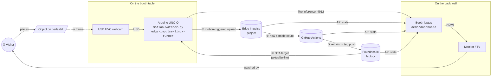

# Booth setup

Everything you need to run **Show. Train. Ship. Repeat.** at a tech-conference booth. Single-UNO-Q variant (cheapest, easiest); see [Scaling to a fleet](#scaling-to-a-fleet) at the bottom for the multi-device version.

## Hardware bill of materials

| Item | Why | ~Cost |
|------|------|------|
| **Arduino UNO Q** | the device under demo | $40 |
| **USB-C 5 V / 3 A power supply** | UNO Q power | $10 |
| **USB UVC webcam** (Logitech C270 / C920 / any UVC class) | object capture, fed to `/dev/video0` | $25–80 |
| **Webcam stand** (gooseneck or short tripod) | aim the camera down at the pedestal | $15 |
| **Pedestal or rotating turntable** | gives objects a clean, repeatable background | $10–20 |
| **Booth laptop** (Mac / Linux) | runs the dashboard server, drives the monitor | already have one |
| **Monitor or TV with HDMI** (24"+ recommended) | the big screen for visitors | venue or BYO |
| **HDMI cable** | laptop → monitor | $10 |
| **WiFi or wired uplink** | UNO Q + laptop both need internet | venue WiFi |
| Cheap **LED ring light** *(optional)* | consistent lighting → fewer false motion triggers | $20 |
| **Printed banner / poster** of [the handout](handout.html) | banner-friendly title for passersby | print shop |
| Stack of printed **handouts** | take-home one-pagers | print shop |

**Total budget for a working single-board booth: ~$120 + venue gear.**

## Top-down booth layout

```
┌──────────────────────────────────────────────────────────┐
│  BOOTH BACK WALL                                         │
│  ┌────────────────────────────────────────────────┐      │
│  │  Monitor / TV (1080p+)                         │      │
│  │  http://localhost:8088 — booth dashboard       │      │
│  └─────────────────────┬──────────────────────────┘      │
│                        │ HDMI                            │
│            ┌───────────┴───────────┐                     │
│            │  Booth laptop         │                     │
│            │  runs demo/dashboard  │ ─── WiFi ──►  EI    │
│            │  serves :8088         │       │     ──►  GH │
│            └───────────────────────┘       │     ──►  Fnd│
│                                            │             │
│  ────────────────────── booth table ─────────────────    │
│                                                          │
│        ┌─────────────┐                                   │
│        │  USB UVC    │                                   │
│        │  webcam     │ ── USB-A ─► ┌─────────────┐       │
│        │  on stand   │             │  Arduino    │       │
│        │             │             │  UNO Q      │       │
│        └──────┬──────┘             │  (Debian    │       │
│               │                    │   aarch64)  │ ──► WiFi
│       field   │                    └──────┬──────┘       │
│       of view │                           │ USB-C power  │
│               ▼                           ▼              │
│        ┌─────────────┐               [Wall PSU]          │
│        │  pedestal   │                                   │
│        │  / rotating │                                   │
│        │  turntable  │                                   │
│        └─────────────┘                                   │
│                                                          │
│  ────────────────────── booth front ─────────────────    │
│                                                          │
│  [ poster: SHOW. TRAIN. SHIP. REPEAT. ]                  │
│  [ stack of handout PDFs ]                               │
└──────────────────────────────────────────────────────────┘
```

## Data flow

What's actually moving while a visitor stands at the table:



The numbered arrows ①–④ are the same four moves on the handout: **Show → Train → Ship → Repeat.**

## Pre-conference checklist

1. **Build the model once** at home so you arrive with `app/model/object-detection.eim` already populated. Run [`scripts/refresh-model.sh`](../../scripts/refresh-model.sh) the day before.
2. **Register the UNO Q** with the factory ahead of time using [`scripts/register-device.sh`](../../scripts/register-device.sh). Verify it pulls a target. If the venue's WiFi blocks `*.foundries.io`, you'll want to know that *before* the conference.
3. **Pre-cache the dashboard env** — `cp demo/dashboard/.env.example demo/dashboard/.env` and fill it in. Test locally that `http://localhost:8088` shows live data.
4. **Print** the banner and ~50 handout PDFs.
5. **Pack a USB-C → USB-A adapter** for the laptop — some laptops only have USB-C and the webcam has USB-A.

## On-the-day checklist

1. **Plug in the UNO Q.** Wait ~30s for `fioup` to come up. Check `sudo fioup check` returns OK over SSH.
2. **Stop the inference container** if you're collecting data with `motion-watcher.py`: `sudo systemctl stop fioup`. If you're *demoing* live inference, keep it running and connect the dashboard's iframe to the UNO Q's `:4912`.
3. **Boot the dashboard:**
   ```bash
   cd demo/dashboard
   docker compose up -d
   open http://localhost:8088
   ```
4. **Aim the camera** at the pedestal. Use the runner's web UI on `:4912` to verify framing.
5. **Set the dashboard's `RUNNER_URL`** in `.env` to `http://<uno-q-ip>:4912` and restart it so the live-inference pane fills.
6. **Test the loop end-to-end** with one object: place → watch motion fire on the dashboard → confirm sample count tick up in the EI pane.

## Common pitfalls

- **Venue WiFi captive portals.** The UNO Q can't click "I accept" on a captive-portal page. Use a hotspot or wired uplink if you can't get a clean DHCP lease.
- **Two consumers of `/dev/video0`.** `motion-watcher.py` and the inference container both want the camera. Stop one, or use a second UVC cam.
- **Lighting changes.** Conference floor lights cycle and shadows from passing visitors will trigger `motion-watcher.py`. Tune `THRESHOLD` and `MIN_AREA` higher than you would at home (e.g. `THRESHOLD=3.0`, `MIN_AREA=12000`).
- **Laptop sleep.** Disable display sleep (`caffeinate -d` on macOS) — otherwise the dashboard goes blank when nobody's clicking.

## Scaling to a fleet

Want the "all three boards update at once" moment? Add 2 more UNO Qs, register each one (`./scripts/register-device.sh` with a different `DEVICE_NAME`), point them at the same scene from different angles, and the dashboard's *device fleet* pane fills out automatically. Same factory, same OTA target, no code changes — that's the point.

Cost delta: **+$120** (2× UNO Q + 2× cheap webcam).
